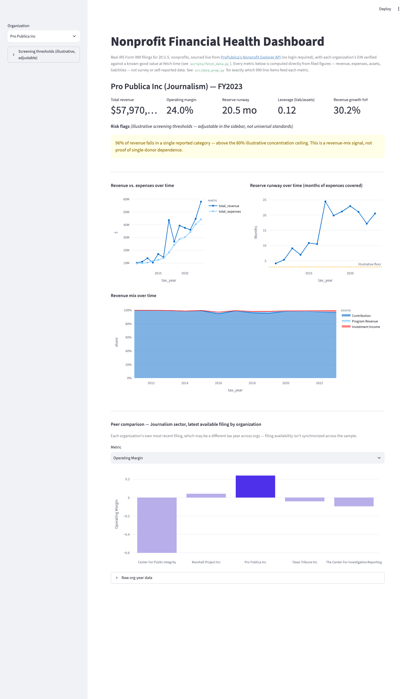

# Nonprofit Financial Health Dashboard

An interactive tool for answering the question a program officer, board
member, or new hire actually asks about a nonprofit: **is this
organization's financial position getting stronger or weaker, and
where's the risk?**



Built on real IRS Form 990 filings for 20 U.S. nonprofits (journalism,
philanthropy infrastructure, education, workforce development, human
services, health, environment, and financial inclusion), pulled live
from ProPublica's own public Nonprofit Explorer API -- the same public
dataset ProPublica's own product runs on.

## What it answers

- Is this org's operating margin, reserve runway, and leverage trending
  up or down over the last decade-plus of filings?
- Is its revenue concentrated in one reported category (donations,
  program fees, or investment income)?
- How does it compare to sector peers with enough of a sample size to
  make a comparison meaningful?
- Does the latest filing trip any illustrative screening thresholds
  worth a closer look?

## Data and methodology

Source: [ProPublica Nonprofit Explorer API](https://projects.propublica.org/nonprofits/api)
(public, no key required), which republishes IRS Form 990 e-file data.
`scripts/fetch_data.py` resolves each organization's EIN by live name
search, then **validates the resolved EIN against a known-good value**
for this fixed 20-org sample before accepting it -- a plain fuzzy-name
search isn't reliable enough to trust blindly (confirmed during
development: a search for "Chalkbeat" ranked an unrelated Baptist
church above the actual newsroom, which is why Chalkbeat isn't in this
sample). A mismatch raises an error rather than silently using the
wrong organization's data.

**What's real vs. what's derived:** every dollar figure (revenue,
expenses, contributions, program revenue, investment income, salaries,
assets, liabilities, net assets) is a line item straight from a filed
990. The health metrics are standard ratios computed from those line
items, with zero-denominator cases returning a missing value rather
than an error or an infinite result:

```
operating_margin                = (revenue - expenses) / revenue
reserve_months                  = net assets / (expenses / 12)
compensation_ratio              = (salaries + officer comp) / expenses
largest_revenue_category_share  = max(contribution %, program revenue %, investment income %)
leverage                        = liabilities / assets
```

`largest_revenue_category_share` is a **revenue-mix concentration
proxy, not a single-source/single-donor concentration measure.** 70%
"contributions" could be one foundation or ten thousand small
individual donors -- this dataset can't distinguish them, and the
dashboard doesn't claim to.

**One honest limitation:** the API's summary fields don't break Form
990 Part IX expenses into program/management/fundraising columns (that
detail only exists in the full e-file XML), so this dashboard does
**not** compute the classic Charity Navigator-style "program expense
ratio." What it computes instead -- reserve runway, leverage, revenue
mix, operating margin -- are genuine, independently useful solvency
signals, and every one is traceable to a specific filed field.

## Screening thresholds are illustrative, not standards

The dashboard flags a filing when it crosses thresholds like "reserve
runway under 3 months" or "leverage over 50%." These are **illustrative
screening thresholds this project chose, not universal nonprofit
solvency standards** -- there's no authoritative source backing "3
months" or "50%" as the correct cutoff for every organization. They're
adjustable in the sidebar for exactly that reason: treat them as a
starting point for judgment, not a rating.

## Peer comparison

Comparisons use **each organization's own most recent filing**, which
can be a different tax year across organizations -- Form 990 filing
timing isn't synchronized across the sample, and the dashboard labels
the comparison "latest available filing by organization" rather than
claiming a single shared fiscal year.

With only 20 organizations across 8 sectors, some sectors have too few
members for "peer comparison" to mean anything (Health and Financial
Inclusion currently have exactly one organization each). Below **3**
organizations in a sector, the dashboard suppresses the peer chart and
says so explicitly instead of showing a one- or two-bar "comparison."

## Run it

```bash
python3 -m venv venv && source venv/bin/activate
pip install -r requirements.txt
python scripts/fetch_data.py
python src/data_prep.py
streamlit run app.py
```

## Tests

```bash
pytest tests/
```

21 tests covering: ratio calculations against known fixtures, zero-
denominator handling (leverage with zero assets returns a missing
value, not infinity), revenue-growth year-over-year logic, each org's
own latest-filing selection (verified to differ across organizations,
not collapse to one shared year), peer-group suppression below the
minimum sample size, risk-flag evaluation against both default and
custom thresholds, and the EIN-verification logic in `fetch_data.py`
(including a mocked case where the top search result doesn't match the
expected organization).

## Structure

```
scripts/fetch_data.py     resolves + verifies EINs, pulls multi-year filings
src/data_prep.py          computes metrics, peer grouping, risk-flag logic
app.py                    Streamlit dashboard
tests/test_data_prep.py   metric/peer-group/risk-flag tests
tests/test_fetch_data.py  EIN-verification tests
```
